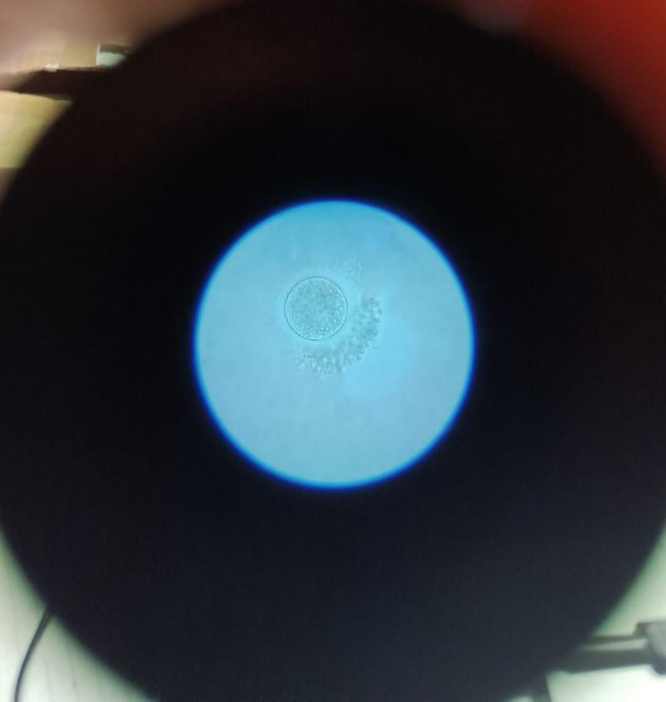
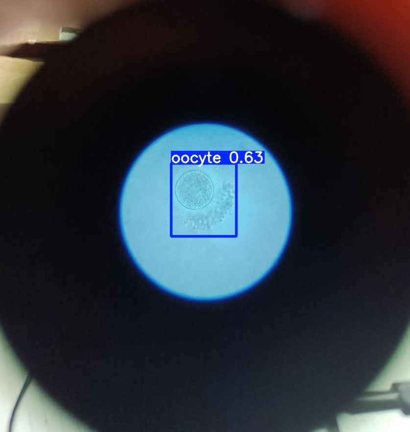

# yolov8-oocyte-detector

Computer vision tool powered by YOLOv8 for automated oocyte detection under a microscope. Optimized for CPU inference via ONNX.

## How to start

1. Clone the repository and navigate to the project folder:
   ```bash
   git clone [https://github.com/ВАШ_НІК/yolov8-oocyte-detector.git](https://github.com/ВАШ_НІК/yolov8-oocyte-detector.git)
   cd yolov8-oocyte-detector
   ```

2. Install the necessary dependencies:
   ```bash
   pip install -r requirements.txt
   ```

3. Run the test script:
   ```bash
   python test.py
   ```

   After executing the script, the results_oocyte_test_photo.jpg file will appear in the folder with the circled oocyte and the confidence percentage of the model.

<details>
  <summary>Original photo</summary>
  
  <br>
  <p align="center">
    
  </p>
</details>


 <details>
  <summary>Recognition result (YOLOv8)</summary>
  
  <br>
  <p align="center">
    
  </p>
</details>
